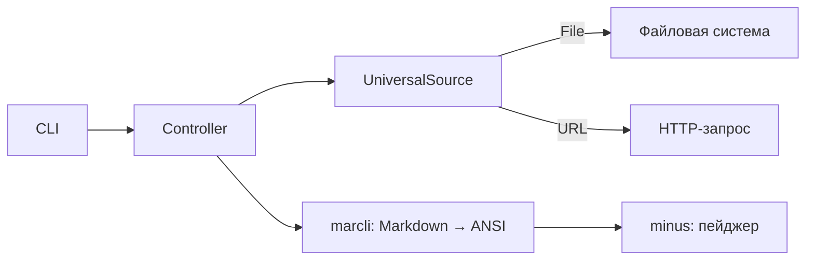

# TaMDa

Доступны переводы:
- [Английский](README.md)
- [Русский](README-RU.md)

**Ta**rminal **M**ark**Da** viewer — утилита для просмотра Markdown-файлов прямо в терминале с полноценной подсветкой синтаксиса и навигацией.

## Возможности

- 📄 Чтение Markdown из **файла**, **URL** или **stdin**
- 🎨 Красивая отрисовка Markdown в терминале (подсветка кода, таблицы, заголовки, ссылки и т.д.)
- 📖 Пейджер с поддержкой прокрутки и поиска (на базе `minus`)
- 🌐 Единый интерфейс для локальных и удалённых источников

## Использование

```bash
# Из файла
tamda README.md

# Из URL
tamda https://raw.githubusercontent.com/user/repo/main/README.md

# Из stdin
curl https://example.com/doc.md | tamda
```

### Управление в пейджере

| Действие | Клавиши |
|----------|---------|
| Прокрутка вниз | `↓`, `Page Down` |
| Прокрутка вверх | `↑`, `Page Up` |
| Поиск | `/` |
| Выход | `q` |

## Установка

### Из исходного кода

```bash
git clone <url-репозитория>
cd tamda
cargo build --release
cp target/release/tamda ~/.local/bin/
```

### Зависимости

- [Rust](https://www.rust-lang.org/) (edition 2024)
- [marcli](https://crates.io/crates/marcli) — рендеринг Markdown в терминал
- [clap](https://crates.io/crates/clap) — парсинг аргументов командной строки
- [reqwest](https://crates.io/crates/reqwest) — загрузка Markdown по URL
- [minus](https://crates.io/crates/minus) — пейджер с поиском
- [anyhow](https://crates.io/crates/anyhow) — удобная обработка ошибок

## Сборка

Проект оптимизирован для минимального размера бинарного файла:

```bash
cargo build --release
```

Настройки профиля `release` используют LTO, `opt-level = "z"` (минимизация размера), `codegen-units = 1` и `strip = true`.

## Архитектура

Приложение построено по простой слоистой схеме:

- **CLI-слой** (`cmd/cli.rs`) — парсит аргументы командной строки с помощью `clap` и передаёт управление контроллеру.
- **Контроллер** (`controllers/index.rs`) — определяет источник данных и оркестрирует выполнение: получение сырого Markdown, рендеринг и отображение.
- **Утилиты** (`util/`) — два вспомогательных модуля:
  - `handler.rs` — общий трейт `Handler` с методом `handle()`, через который контроллер интегрируется с CLI.
  - `universal_source.rs` — enum `UniversalSource` с вариантами `File` и `URL`. Автоматически определяет тип источника по строке (через `From<&str>`) и загружает данные соответствующим способом.

**Поток выполнения:**


