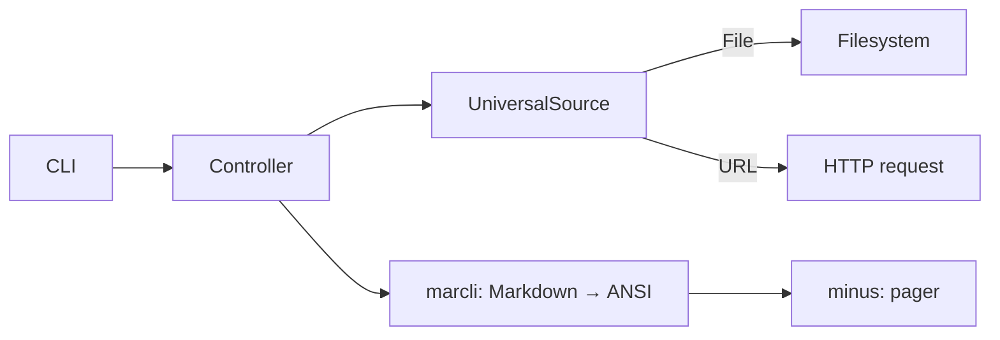

# TaMDa

Available translations:
- [English](README.md)
- [Russian](README-RU.md)

**Ta**rminal **M**ark**Da** viewer — a utility for viewing Markdown files directly in the terminal with full syntax highlighting and navigation.

## Features

- 📄 Read Markdown from a **file**, **URL**, or **stdin**
- 🎨 Beautiful Markdown rendering in the terminal (code highlighting, tables, headings, links, etc.)
- 📖 Pager with scrolling and search support (powered by `minus`)
- 🌐 Unified interface for local and remote sources

## Usage

```bash
# From a file
tamda README.md

# From a URL
tamda https://raw.githubusercontent.com/user/repo/main/README.md

# From stdin
curl https://example.com/doc.md | tamda
```

### Pager Controls

| Action | Keys |
|--------|------|
| Scroll down | `↓`, `Page Down` |
| Scroll up | `↑`, `Page Up` |
| Search | `/` |
| Quit | `q` |

## Installation

### From source

```bash
git clone <repository-url>
cd tamda
cargo build --release
cp target/release/tamda ~/.local/bin/
```

### Dependencies

- [Rust](https://www.rust-lang.org/) (edition 2024)
- [marcli](https://crates.io/crates/marcli) — Markdown to terminal rendering
- [clap](https://crates.io/crates/clap) — command-line argument parsing
- [reqwest](https://crates.io/crates/reqwest) — fetching Markdown via URL
- [minus](https://crates.io/crates/minus) — pager with search
- [anyhow](https://crates.io/crates/anyhow) — flexible error handling

## Build

The project is optimized for a minimal binary size:

```bash
cargo build --release
```

The `release` profile uses LTO, `opt-level = "z"` (size minimization), `codegen-units = 1`, and `strip = true`.

## Architecture

The application follows a simple layered design:

- **CLI layer** (`cmd/cli.rs`) — parses command-line arguments using `clap` and delegates control to the controller.
- **Controller** (`controllers/index.rs`) — determines the data source and orchestrates execution: fetching raw Markdown, rendering, and displaying.
- **Utilities** (`util/`) — two helper modules:
  - `handler.rs` — a common `Handler` trait with a `handle()` method that integrates the controller with the CLI.
  - `universal_source.rs` — an `UniversalSource` enum with `File` and `URL` variants. It automatically detects the source type from a string (via `From<&str>`) and loads data accordingly.

**Execution flow:**


